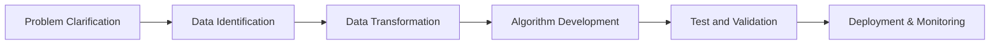
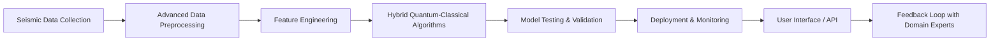

# Quantum Earthquake Prediction

**Predicting earthquakes using the power of quantum computing.**

---

## Why?

Earthquakes are among the most destructive natural disasters. Early and accurate prediction could save lives, enable better preparedness, and mitigate damage. Quantum computing offers the potential to address the complexities of seismic data analysis and prediction.

---

## What?

This project aims to:
- Define challenges and goals in earthquake prediction.
- Identify and preprocess seismic datasets.
- Develop quantum algorithms for seismic pattern recognition.
- Validate and deploy predictive models.
- Continuously monitor and improve the system.

---

## How?

### Roadmap

#### Roadmap

### High-Level Architecture

### **Updated Components**

1. **Seismic Data Collection**
   - **Data Sources**: USGS Earthquake Catalog, IRIS, ISC, and additional international seismic networks.
   - **Automation**: Implement APIs and webhooks for real-time data acquisition.

2. **Advanced Data Preprocessing**
   - **Noise Reduction**: Apply filters to minimize seismic noise and instrument errors.
   - **Data Imputation**: Use statistical methods to handle missing or incomplete data.
   - **Normalization & Scaling**: Prepare data for machine learning models.

3. **Feature Engineering**
   - **Time-Series Segmentation**: Divide data into meaningful time windows.
   - **Frequency Analysis**: Utilize wavelet transforms for multi-resolution analysis.
   - **Spatial Feature Extraction**: Incorporate geospatial correlations between seismic events.

4. **Hybrid Quantum-Classical Algorithms**
   - **Classical Models**:
     - **Deep Learning**: Employ CNNs and RNNs for pattern recognition in time-series data.
     - **Ensemble Methods**: Use techniques like Gradient Boosting for improved performance.
   - **Quantum Components**:
     - **Variational Quantum Circuits (VQCs)**: Integrate VQCs within classical neural networks for specific sub-tasks.
     - **Quantum Feature Maps**: Use quantum kernels to project data into higher-dimensional spaces.
   - **Hybrid Integration**:
     - **Data Preprocessing**: Use quantum algorithms for feature extraction.
     - **Model Training**: Combine classical optimizers with quantum circuits.

5. **Model Testing & Validation**
   - **Cross-Validation**: Implement k-fold cross-validation for robust evaluation.
   - **Metrics**:
     - **Accuracy, Precision, Recall, F1-Score**
     - **ROC Curve & AUC**
     - **Confusion Matrix Analysis**
   - **Stress Testing**: Assess models with noisy, sparse, and adversarial data.

6. **Deployment & Monitoring**
   - **Scalable Infrastructure**: Use cloud services like AWS, Azure, or GCP for scalability.
   - **Latency Management**: Optimize quantum computations to meet near-real-time requirements.
   - **Continuous Integration/Continuous Deployment (CI/CD)**: Automate deployment pipelines.

7. **User Interface / API**
   - **Interactive Dashboards**: Implement using frameworks like Dash or Streamlit.
   - **Data Visualization**: Use Plotly or D3.js for advanced visualizations.
   - **Accessibility Compliance**: Ensure UI meets WCAG standards.

8. **Feedback Loop with Domain Experts**
   - **Collaboration Platforms**: Use tools like Jupyter notebooks for shared analysis.
   - **Expert Annotations**: Incorporate insights from seismologists into model refinement.
   - **Model Interpretability**: Use SHAP or LIME for explaining model predictions.

---

## **Detailed Approach & Milestones**

### **1. Problem Clarification**

- **Scope Definition**: Focus on regional prediction to manage data complexity.
- **Success Criteria**: Establish quantifiable goals, e.g., improving prediction accuracy by a certain percentage over classical models.
- **Challenge Documentation**: Detail data sparsity issues and model limitations.

### **2. Data Identification & Collection**

- **Enhanced Data Sources**: Include satellite data, GPS measurements, and geological surveys.
- **Data Integration**: Merge datasets to enrich feature space.
- **Ethical Compliance**: Ensure data collection complies with regulations like GDPR.

### **3. Advanced Data Transformation**

- **Feature Scaling**: Apply techniques like Z-score normalization.
- **Dimensionality Reduction**: Use PCA or t-SNE to manage high-dimensional data.
- **Temporal Feature Extraction**: Capture temporal dependencies using sliding windows.

### **4. Hybrid Quantum-Classical Algorithm Development**

- **Quantum Frameworks**: Utilize Qiskit and PennyLane for hybrid model development.
- **Circuit Optimization**: Implement parameterized quantum circuits optimized via classical optimizers.
- **Simulation First**: Test quantum components on simulators before hardware execution.
- **Resource Management**: Plan quantum hardware usage considering cost and availability.

### **5. Testing & Validation**

- **Benchmarking**: Compare hybrid models against classical deep learning models.
- **Error Mitigation**: Implement techniques to reduce quantum noise impacts.
- **Interpretability**: Use model-agnostic methods to explain predictions.

### **6. Deployment & Inferencing**

- **Microservices Architecture**: Deploy components as independent services for scalability.
- **API Development**: Create RESTful APIs for model access.
- **Edge Computing**: Consider processing data closer to source to reduce latency.

### **7. Monitoring, Feedback, and Continuous Improvement**

- **Performance Monitoring**: Use tools like Prometheus and Grafana.
- **Automated Retraining**: Set triggers for model retraining based on performance metrics.
- **User Feedback Mechanisms**: Allow users to report anomalies or provide data.

---

---

## Call for Volunteers 🚀

We are seeking contributors to join this exciting project! Whether you're a quantum computing enthusiast, a machine learning expert, or a seismology researcher, we welcome your help.

### Open Positions:
1. **Quantum Computing Developer**: Implement and optimize quantum algorithms.
2. **Data Scientist**: Preprocess seismic data and extract features.
3. **Seismologist**: Provide domain expertise on seismic phenomena.
4. **Full-Stack Developer**: Build APIs and interfaces for deployment.
5. **Community Manager**: Manage discussions and documentation.

### How to Contribute
1. Fork the repository.
2. Create a feature branch for your contribution.
3. Submit a pull request with your changes.
4. Join our Discord community for collaboration (link TBD).

---

## Contact

For inquiries or collaboration, contact us at **TBD**.

